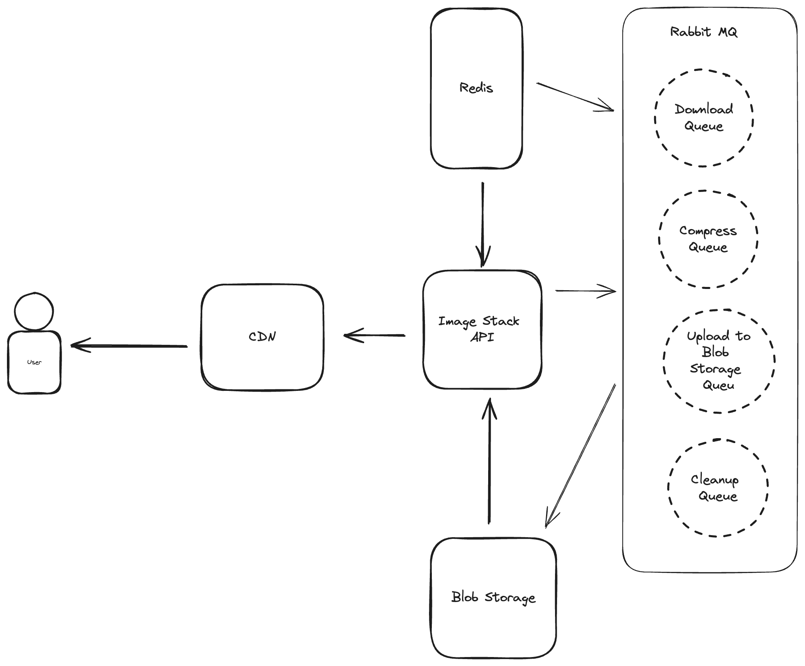

# ImageStack

Service to compress images on the fly

## Development

### Architecture

### Usage

`docker compose up`

1. RabbitMQ dashboard: http://localhost:15672
2. App endpoints:

- Check status of any image: http://localhost:8080/status?url={your-image-url}
- To process a new image: http://localhost:8080/submit?url={your-image-url}

## Goal

Currently all the queues get handled by the same service which serves endpoint to the end user.
Goal is run different queues in their own service talking to the same rabbit mq.
And then scale services based on the usage.
